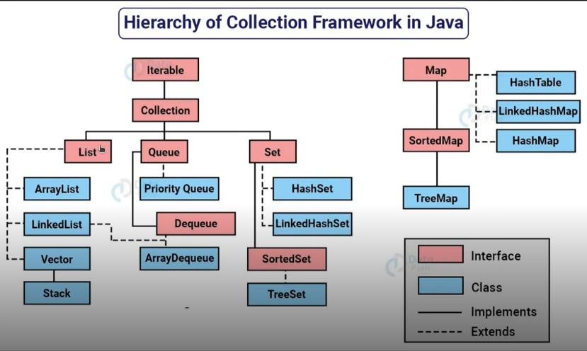

# Collections Java

- Parte teórica

Códigos de exemplo retirados do curso de Fundamentos da Programação Orientada a Objetos com Java da DIO professora .

## Collection Framework API

- **Collection:** é uma estrutura de dados que serve para agrupar muitos elementos em uma única unidade. Tais elementos são objetos **(ou seja, não aceita tipo primitivo, int---> Integer; double ---> Double; String=String...)**;

- Uma collection pode ter coleções **homogênias e heterogêneas**, mais comum serem homogêneas (contém um tipo específico). Usando herança por exemplo, poderia ter as classes Veiculo, Carro extands Veiculo e Moto extands Veiculo. Neste caso um array (coleção) de veículo seria uma coleção heterogênia, enquanto um array de carro ou array de moto são homogêneos.

- O **núcle principal** das coleções é formado pelas interfaces que permitem manipular a coleção independemente do nível de detalhe que elas representam;

- Existem **4 tipos de collections** das quais pode-se ter subclasses que implementam várias formas diferentes de se trabalhar com cada uma das coleções, são elas

**List** (lista):

**Set** (conjunto):

**Queue** (fila):

**Map** (mapa):



- Todas essas classes e interfaces estão dentro do package java.util;

- Embora a interface Map não seja filha direta da interface Collection, ela também é considerada uma coleção devido às suas funções.

## Generics type

- Um tipo generico é uma classe genérica ou uma interface que é parametrizada em relação a tipos;

- A classe Box a seguir será modificada para demonstrar o conceito:

```js
public class Box {
    private Object object;

    public void set(Object object) { 
        this.object = object; 
        }
    public Object get() {
         return object; 
         }
}
```

- O dimond operator `(<>)` é usado no contexto de tipos genéricos para inferir automaticamente o tipo com base no contexto. Ou seja, declarando que o box é do tipo T, todos os objetos criados na classe box serão do tipo T automaticamente.

- Para usar o conceito de generics no código acima é preciso declarar a classe box com o < > e o tipo dentro dele. Essa variável de tipo T, pode ser usada em qualquer lugar dentro da classe, assim:

```js
/**
Versão genérica da classe Box.
@param <T> o tipo do valor sendo armazenado
*/
public class Box<T> {
	// T representa "Type" (tipo)
    private T t;

    public void set(T t) { this.t = t; }
    public T get() { return t; }
}
```

Neste caso, todas as ocorrências de objetos são substituídas por T. As variáveis podem ser de quaisquer tipo **não primitivo** (Integer, Styring, Double), ou seja, qualquer tipo de **classe**, de **interface**, de **array** e até outra **variável de tipo**. Pode-se também criar interfaces genéricas desta forma.

Os nomes mais usados de parâmetros de tipo são: 

- **E:** Elemento;
- **K:** Chave;
- **N:** Número;
- **T:** Tipo;
- **V:** Valor;
- **S, U, V etc:** Segundo, terceiro, quarto tipos

## Vantagens simples de usar generics nas interfaces Collection Java

1. Segurança do tipo de dados. O uso de generics garante que apenas objetos de um tipo específico possam ser adicionados a coleção, evitando erros;
2. Código mais legível, é possível especificar o tipo de dado esperado ou retornado pela coleção;
3. Facildiade na detecção de erros (pelos motivos acima o próprio compilador verifica se os tipos estão corretos)
4. Reutilização de código. É possível criar classes e métodos genéricos que fincionam com diferentes tipos de coleções;
5. Melhor desempenho, pois evita a necessidade de conversões de tipo desnecessárias.

## Comparable e Comparator

### Funções e características do Comparable

- Fornecer uma sequência de ordenação de um array ou matriz (ordena com base em um único elemento, por exemplo, id ou nome ou preço ou...);
- Afeta a classe original, ela é alterada;
- O método para ordenar elementos é o `compareTo()`;
- Está presente no pacote java.lang;
- É possível ordenar os elementos da lista (List) comparable usando o método `Collections.sort(List)`

### Funções e características Comparator

- Ordenar os elementos com o método `compare()`;
- Fornece múltiplas sequências, ou seja, ordena a lista com base em múltiplos elementos (id e nome e preço e...);
- Não altera a classe original;
- Está presente no pacote java.util;
- É possível ordenar os elementos da lista (List) comparable usando o método `Collections.sort(List, Comparator)`;

### Collections

A classe `Collections` é utilitária do Java para operações comuns a coleções. Ela fornece métodos para ordenação, busca, manipulação e sincronização de coleções. O método `sort()` é usado para ordenar uma lista em ordem crescente, para ser decrescente pode-se usar o `sort()` em um conjunto `Collections.reverseOrder()`.

Exemplo de códigos:
```java
package main.java.comparableXcomparator;

import java.util.ArrayList;
import java.util.Collections;

public class Main {
	public static void main(String[] args) {
		System.out.println("---------------------------------------");
		ArrayList<Livro> livros = new ArrayList<Livro>() {
			{
				add(new Livro("Java - Guia do Programador: Atualizado Para Java 16", "Peter Jandl Junior", 2021));
				add(new Livro("Desenvolvimento Real de Software: Um guia de projetos para fundamentos em Java",
						"Raoul-Gabriel Urma e  Richard Warburton", 2021));
				add(new Livro(
						"Microsserviços Prontos Para a Produção: Construindo Sistemas Padronizados em uma Organização de Engenharia de Software",
						"Susan J. Fowler", 2017));
				add(new Livro("Entendendo Algoritmos: Um Guia Ilustrado Para Programadores e Outros Curiosos",
						"Aditya Y. Bhargava", 2017));
				add(new Livro("Kotlin em Ação", "Dmitry Jemerov e Svetlana Isakova", 2017));
			}
		};

		
		System.out.println("Livros após a ordenação natural (Título): ");
		Collections.sort(livros);
		for (Livro livro : livros) {
			System.out.println(livro.getTitulo() + " - " +
					livro.getAutor() + " - " +
					livro.getAno());
		}

		System.out.println("---------------------------------------");

		System.out.println("Livros após a ordenação por ano: ");
		Collections.sort(livros, new CompararAno());
		for (Livro livro : livros) {
			System.out.println(livro.getAno() + " - " +
					livro.getTitulo() + " - " +
					livro.getAutor());
		}

		System.out.println("---------------------------------------");

		System.out.println("Livros após a ordenação por autor: ");
		Collections.sort(livros, new CompararAutor());
		for (Livro livro : livros) {
			System.out.println(livro.getAutor() + " - " +
					livro.getTitulo() + " - " +
					livro.getAno());
		}

		System.out.println("---------------------------------------");

		System.out.println("Livros após a ordenação por ano, autor e título: ");
		Collections.sort(livros, new CompararAnoAutorTitulo());
		for (Livro livro : livros) {
			System.out.println(livro.getAno() + " - " +
					livro.getAutor() + " - " +
					livro.getTitulo());
		}
	}
}
```
Classes

```java
package main.java.comparableXcomparator;

import java.util.Comparator;

// Uma classe 'Livro' que implementa Comparable (altera a classe original, pois é implementado dentro dela)
class Livro implements Comparable<Livro> {
	private String titulo;
	private String autor;
	private int ano;

	// Construtor
	public Livro(String ti, String au, int an) {
		this.titulo = ti;
		this.autor = au;
		this.ano = an;
	}

	// Usado para ordenar livros por ano
	public int compareTo(Livro l) {
		return ano.compareTo(l.ano);
	}

	// Métodos getters para acessar os dados privados
	public String getTitulo() {
		return titulo;
	}

	public String getAutor() {
		return autor;
	}

	public int getAno() {
		return ano;
	}
}

// Classe para comparar Livro por autor (fora da classe livro - nao altera a classe original)
class CompararAutor implements Comparator<Livro> {
  @Override
  public int compare(Livro l1, Livro l2) {
		return l1.getAutor().compareTo(l2.getAutor());
	}
}

// Classe para comparar Livro por ano
class CompararAno implements Comparator<Livro> {
  @Override
  public int compare(Livro l1, Livro l2) {
		if (l1.getAno() < l2.getAno())
			return -1;
		if (l1.getAno() > l2.getAno())
			return 1;
		else
			return 0;
	}
}

class CompararAnoAutorTitulo implements Comparator<Livro> {
	@Override
	public int compare(Livro l1, Livro l2) {
		int ano = Integer.compare(l1.getAno(), l2.getAno());
		if (ano != 0)
			return ano;
		int autor = l1.getAutor().compareTo(l2.getAutor());
		if (autor != 0)
			return autor;
		return l1.getTitulo().compareTo(l2.getTitulo());
	}
}
```

Códigos de exemplo retirados do curso de Fundamentos da Programação Orientada a Objetos com Java da DIO professora .
